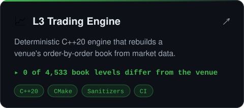
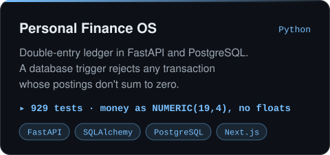
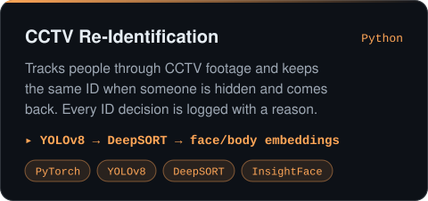
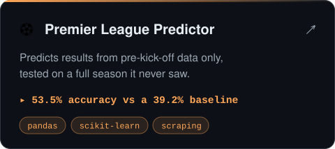
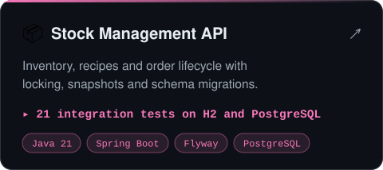
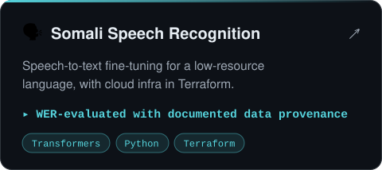

  

  

<h3>⭐ Featured work</h3>

  
  
  
  
  
  

<h3>🧰 Also built</h3>
<table>
  <tr><td>🎮 <b>Games</b></td><td><a href="https://github.com/FuaadBashi/Chess-TUI">Chess</a> · <a href="https://github.com/FuaadBashi/Hnefatafl-TUI">Hnefatafl</a> · <a href="https://github.com/FuaadBashi/PokerGame">Poker</a> · <a href="https://github.com/FuaadBashi/FlappyBird">Flappy Bird</a> · <a href="https://github.com/FuaadBashi/TUI-Based-ShooterGame">Terminal shooter</a></td></tr>
  <tr><td>🎧 <b>Graphics &amp; audio</b></td><td><a href="https://github.com/FuaadBashi/MotionWavePlus">MotionWave+</a> · <a href="https://github.com/FuaadBashi/MotionWave">MotionWave</a> · <a href="https://github.com/FuaadBashi/Sorting-Algorithm-visulaizer">Sorting visualiser</a></td></tr>
  <tr><td>⚙️ <b>Systems in C</b></td><td><a href="https://github.com/FuaadBashi/Employee-Management-System-with-HashTable">Hash-table records</a> · <a href="https://github.com/FuaadBashi/Collective-Telephone-and-Mobile-Customer-Record-System">Telephone billing</a></td></tr>
  <tr><td>🌐 <b>Web &amp; apps</b></td><td><a href="https://github.com/FuaadBashi/SokoPay_website">SokoPay</a> · <a href="https://github.com/FuaadBashi/TypeTrainer-JavaFX">TypeTrainer</a> · <a href="https://github.com/FuaadBashi/Text-To-Speech-Generator">Text-to-Speech</a></td></tr>
  <tr><td>🧠 <b>ML &amp; data</b></td><td><a href="https://github.com/FuaadBashi/Animal-Image-Classifier-Cat-Dog-Fox-Prediction-with-TensorFlow">Animal classifier</a> · <a href="https://github.com/FuaadBashi/Dubai-Property-Webscraper">Dubai property scraper</a> · <a href="https://github.com/FuaadBashi/UniversalWebScraper">Universal web scraper</a></td></tr>
  <tr><td>🧩 <b>Algorithms</b></td><td><a href="https://github.com/FuaadBashi/LeetCode-Solutions">LeetCode</a> · <a href="https://github.com/FuaadBashi/Dynamic-programming-recurrence-for-computing-minimum-sum-combinations.">DP minimum-sum combinations</a></td></tr>
</table>
<!-- Add your contact links here and delete this comment, e.g.

<a href="https://www.linkedin.com/in/YOUR-HANDLE">LinkedIn</a> · <a href="mailto:YOUR-EMAIL">Email</a>

-->
