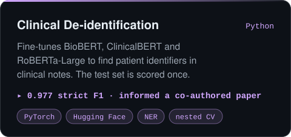
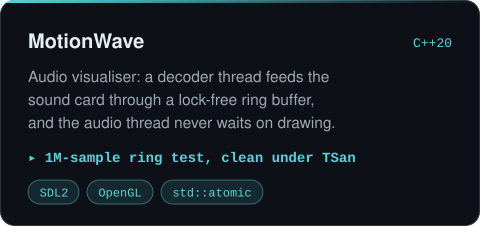

  

  Most of my work is in C++, Python and Java: market-data replay and real-time audio in C++,
  backend services in Python and Java, and machine learning in Python. I'm a co-author of a
  conference paper on medical named-entity recognition accepted at ICACIn (to appear), which draws
  on the clinical de-identification project below.

  

<h3>Selected projects</h3>

  
  
  
  
  
  

<h3>Other projects</h3>
<table>
  <tr><td><b>Python</b></td><td><a href="https://github.com/FuaadBashi/speech-to-text-AI-models-for-the-Somali-language">Somali speech recognition</a> (Whisper fine-tuning, Terraform) · <a href="https://github.com/FuaadBashi/Premier-League-Outcome-Predictor">Premier League predictor</a> (53.5% vs a 39.2% baseline) · <a href="https://github.com/FuaadBashi/Animal-Image-Classifier-Cat-Dog-Fox-Prediction-with-TensorFlow">cat/dog/fox classifier</a> (TensorFlow) · <a href="https://github.com/FuaadBashi/Dubai-Property-Webscraper">Dubai property scrapers</a> · <a href="https://github.com/FuaadBashi/Sorting-Algorithm-visulaizer">sorting visualiser</a> · <a href="https://github.com/FuaadBashi/Dynamic-programming-recurrence-for-computing-minimum-sum-combinations.">minimum-sum DP</a></td></tr>
  <tr><td><b>C++</b></td><td><a href="https://github.com/FuaadBashi/MotionWavePlus">MotionWave+</a> (raylib and miniaudio rewrite of MotionWave)</td></tr>
  <tr><td><b>Java</b></td><td><a href="https://github.com/FuaadBashi/Chess-TUI">chess</a> · <a href="https://github.com/FuaadBashi/Hnefatafl-TUI">Hnefatafl</a> · <a href="https://github.com/FuaadBashi/PokerGame">poker</a> · <a href="https://github.com/FuaadBashi/FlappyBird">Flappy Bird</a> · <a href="https://github.com/FuaadBashi/TypeTrainer-JavaFX">TypeTrainer</a> (JavaFX) · <a href="https://github.com/FuaadBashi/TUI-Based-ShooterGame">terminal shooter</a></td></tr>
  <tr><td><b>C</b></td><td><a href="https://github.com/FuaadBashi/Employee-Management-System-with-HashTable">hash-table employee records</a> · <a href="https://github.com/FuaadBashi/Collective-Telephone-and-Mobile-Customer-Record-System">telephone billing</a> · <a href="https://github.com/FuaadBashi/LeetCode-Solutions">LeetCode solutions</a></td></tr>
  <tr><td><b>Web</b></td><td><a href="https://github.com/FuaadBashi/SokoPay_website">SokoPay</a> (Next.js payments prototype) · <a href="https://github.com/FuaadBashi/TinDog-WebPage">TinDog</a> (Bootstrap landing page)</td></tr>
</table>
